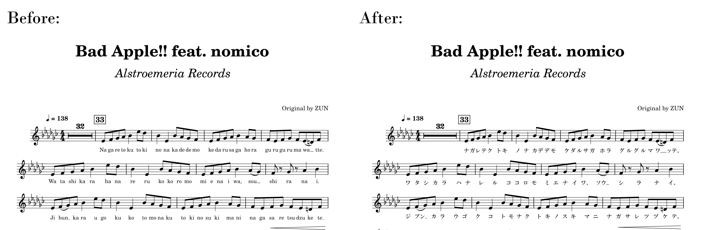

## Romaji2Katakana plugin for MuseScore 3
Romaji2Katakana is a plugin for MuseScore 3 which converts rōmaji lyrics like 'ra' and 'to' to 「ラ」 and 「ト」.

Makes kana lyric entry easier to work around MS3's issues with kana entry using a JP keyboard or EN keyboard with IME.

See also https://github.com/dragonwithafez/Romaji2Hiragana for an equivalent tool for converting to hiragana.

The plugin will preserve existing kana, both hiragana and katakana.

### Installation
Download the latest release from the Releases sidebar, or clone the repository. Unzip the downloaded files into MuseScore's Plugins folder, then open MuseScore, navigate to the Plugin Manager and check Romaji2Katakana. If desired for space reasons, you may delete any files within the extracted directory except "Romaji2Katakana.qml".

#### Uninstallation
Delete the Romaji2Katakana folder from MuseScore's Plugins folder.

### Usage
Enter the romaji lyrics of your composition in MuseScore 3. Running the plugin will convert all lyrics written in the Latin alphabet within the current selection to their respective kana, preserving existing kana and punctuation.

For lyrics such as 「ナッタ」 spread over two notes, they can be entered as either 'nat -ta' or 'na -tta', depending on whether you want 「ナッ -タ」 or 「ナ -ッタ」.

Chōompu (long vowel symbol, 「ー」) should be entered as a dash ('-') placed in the lyric itself. To achieve this, hold down Control while pressing the dash key, or Command on a Mac.

### Limitations
「ハ」、「ヘ」、「ヲ」 must be entered as 'ha', 'he', 'wo', regardless of pronunciation. Code can't read your mind :)

Diacritics are not supported; enter long vowels as double letters, i.e. 「モウ」 should be entered as "mou" not "mō" or "mô".

Any non-Japanese lyrics using Latin characters in the current selection will be converted to kana with potentially unwanted results. Make sure any such lyrics are not selected when running the plugin.

As of version 1.2.1, the plugin no longer supports multiple romanizations of kana such as 'shi'/'si'-「シ」、'dji'/'di'-「ヂ」、etc. Only one conversion per kana is supported. See https://github.com/dragonwithafez/Romaji2Hiragana/wiki/Conversion-table for current kana conversion table.

### Changelog

#### Changes in version 2.0.1
- Fix an issue with conversion of lyrics in voices other than 1
- Fix an issue with running the plugin on already-converted lyrics

#### Changes in version 2.0.0

- Implement https://github.com/dragonwithafez/Romaji2Katakana/issues/2 (Allow extended kana such as 'fi'-「フィ」)
- Implement https://github.com/dragonwithafez/Romaji2Hiragana/issues/6 (Plugin no longer affects entire score)
- Fix https://github.com/dragonwithafez/Romaji2Hiragana/issues/8

#### Changes in version 1.2.1
- Remove alternate conversions of certain kana in preparation for next major update. See https://github.com/dragonwithafez/Romaji2Hiragana/wiki/Conversion-table for current kana conversion table
- Fix https://github.com/dragonwithafez/Romaji2Katakana/issues/1
- Fix https://github.com/dragonwithafez/Romaji2Hiragana/issues/5
- Fix https://github.com/dragonwithafez/Romaji2Hiragana/issues/4
- Fix an issue with conversion of exclamation marks

#### Initial release 1.2.0
- Code converted from https://github.com/dragonwithafez/Romaji2Hiragana version 1.2.0 for use with katakana

### Before and after using plugin

